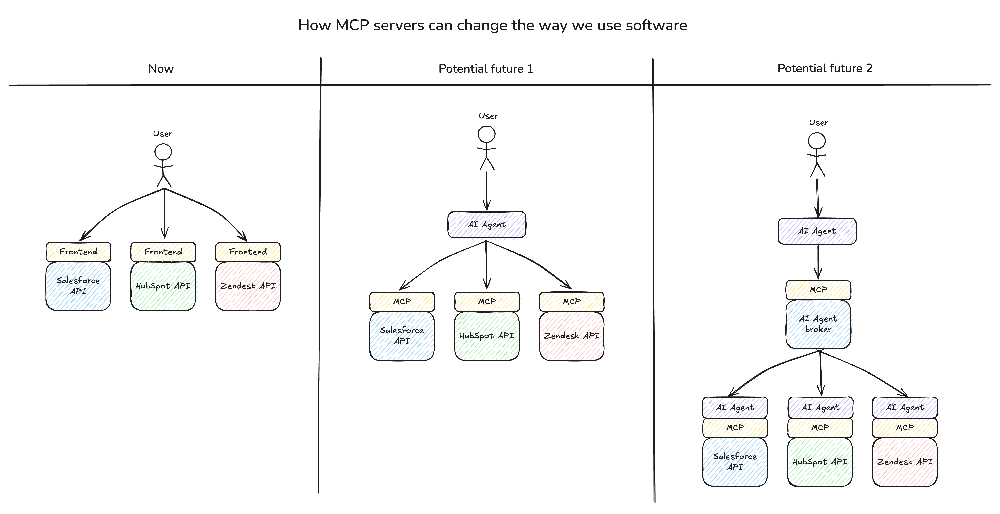

# How MCP (or similar standards) Could Change the Way We Use Software with AI

I think many of my colleagues here at [Dinero](https://dinero.dk/) will agree when I say I’ve been *deep down the MCP-server rabbit hole* lately 🕳️😅

I’ve spent quite a bit of time trying to understand MCP servers, public opinions around the standard, and—most importantly—how it might shape the way we use software in the future.

And now many of you might be asking:

**What the heck is an MCP server? 🤔**

Here’s my best explanation so far:

> **MCP is a standardized frontend for AI agents.**

I’ve created a diagram to illustrate how I imagine MCP servers might impact the future of software usage.

Below is a brief walkthrough of the diagram 👇

---

## 𝗧𝗼𝗱𝗮𝘆

Users interact manually with each system (Salesforce, HubSpot, Zendesk) via individual frontends. Everything relies on human contextual understanding and manual navigation.

---

## 𝗣𝗼𝘁𝗲𝗻𝘁𝗶𝗮𝗹 𝗙𝘂𝘁𝘂𝗿𝗲 𝟭

Users talk to a single AI agent, which uses MCP servers to interact with various platforms. No more jumping between systems. The AI understands the task, and the MCP servers ensure the AI agent can interface with and understand each system.

---

## 𝗣𝗼𝘁𝗲𝗻𝘁𝗶𝗮𝗹 𝗙𝘂𝘁𝘂𝗿𝗲 𝟮

Users still only interact with one AI agent. However, this agent communicates with an MCP **core**, which delegates tasks to specialized AI agents for each system. This enables an even more intelligent and modular approach, where tasks are handled by *experts* (AI agents) for each system—like a team of specialists orchestrated behind the scenes.

---

If you buy into this, several interesting questions remain in the "Potential Future 2" scenario: 
- Who will build and own the AI agent broker? 
- Will it be controlled by a single company or developed collaboratively by multiple players? 
- Will it be open-source or proprietary? 
- Will software companies in the future need to build an AI agent interface for their products—just as they do today for desktop and mobile?
- What’s the incentive for companies to contribute agents to a shared broker?
- Who decides which agent gets delegated a task—and on what basis?
- Will brokers develop "preferences" or bias towards certain agents?